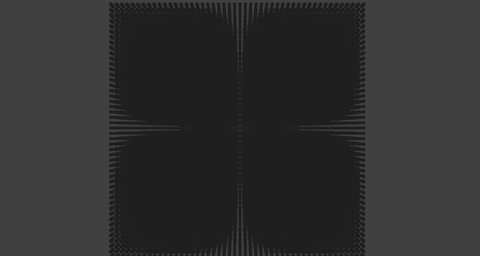
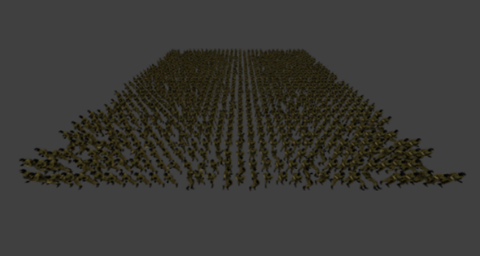
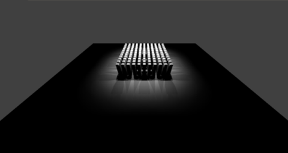
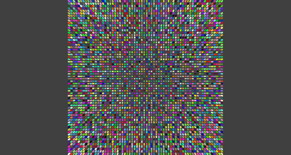

# Ultra Engine Benchmarks

Rendering performance benchmarks comparing Ultra Engine, Leadwerks, and Unity.

Four tests were created to isolate and measure different aspects of the graphics pipeline in each engine.

### Instanced Geometry

This measures the performance of object culling speed in a worst-case scenario where frustum culling removes no objects.

### Animation

This demonstrates the efficiency of the animation pipeline. Each character has a unique skeleton and a relatively low polygon count, because the vertex shader speed is probably going to be similar in each engine. This is meant to test the efficiency of skeleton data transfer, and determine if animation introduces any overhead to the renderer.

### Lighting

This measures the performance of a large number of lights against a large number of identical objects. I was surprised to find that Unity redraws every single shadow map every single frame, instead of only updating shadows when an object moves.

### Unique Geometry

This test is the most representative of an actual game level, with many different unique objects. It measures the overhead of draw calls and the efficiency of the mesh batching system.

## System Requirements

- Windows 10 or greater
- Discrete GPU with support for Vulkan 1.3

## Diagnostic Tools

[FRAPS](https://www.fraps.com) can be used to measure the framerate. Some other FPS counter overlays will reduce performance significantly enough to alter your readings, by a lot.

[TechPowerUp GPU-Z](https://www.techpowerup.com/download/gpu-z/) can be used to measure GPU utilization. Windows task manager does not correctly measure this metric.

## Results

In each test, Ultra Engine outperforms Leadwerks, Unity, or both by a factor greater than 10x. All measurements were recorded using a PC with a quad-core Intel Core i7-7700K CPU @4.20 GHz and an Nvidia GeForce 1080 GTX GPU with driver 471.41 installed, on Windows 10.

### Instanced Geometry Test

| Engine | GPU Utilization | Framerate |
|--|--|--|
| Leadwerks (OpenGL) | 8% | 52 |
| Unity (DX11) | 4% | 40 |
| Unity (Vulkan) | 4% | 40 |
| Ultra Engine (Vulkan) | 95% | 1206 |

### Animation Test

| Engine | GPU Utilization | Framerate |
|--|--|--|
| Leadwerks (OpenGL) | 1% | 5 |
| Unity (DX11) | 45% | 62 |
| Unity (Vulkan) | 45% | 64 |
| Ultra Engine (Vulkan) | 96% | 1179 |

### Lighting Test

| Engine | GPU Utilization | Framerate |
|--|--|--|
| Leadwerks (OpenGL) | 49% | 704 |
| Unity (DX11) | 33% | 90 |
| Unity (Vulkan) | 30% | 74 |
| Ultra Engine (Vulkan) | 96% | 1456 |

### Unique Geometry Test

| Engine | GPU Utilization | Framerate |
|--|--|--|
| Leadwerks (OpenGL) | 10% | 49 |
| Unity (DX11) | 5% | 2 |
| Unity (Vulkan) | 4% | 2 |
| Ultra Engine (Vulkan) | 63% | 6213 |
